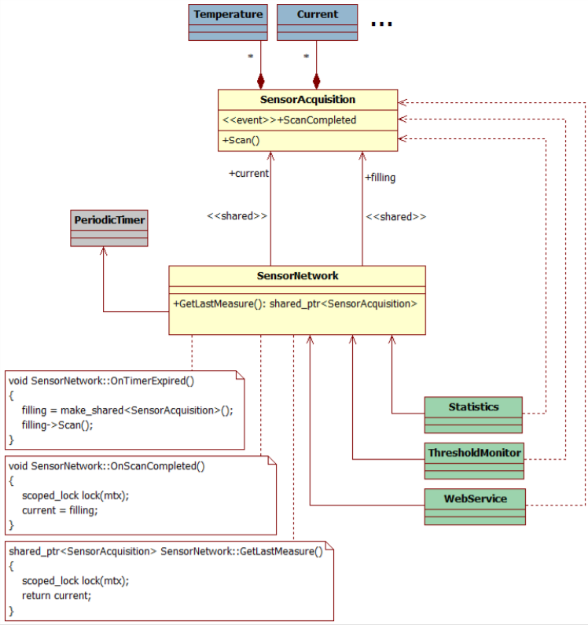
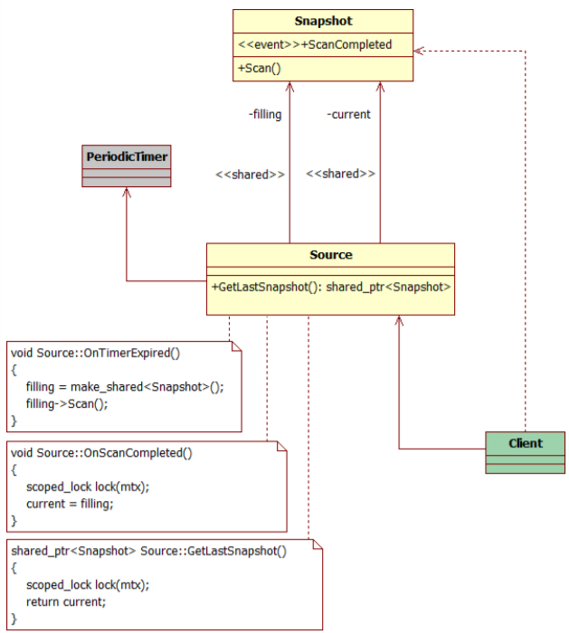

# [Flip Model 设计模式](https://accu.org/var/uploads/journals/Overload148.pdf#page=8)

文章中展示了一种在多线程安全的场景下发布动态、复杂数据到多个客户端的设计模式.

## 模式名称和分类

Flip Model(behavioral)

## 意图

该模式允许多个客户端以线程安全的方式读取一个复杂的数据模型,这个数据模型被唯一的生产者持续更新.

## 别名

Model publisher,Pressman,Newsagent.

## 动机

有些时候需要讲一个复杂的数据结构的使用从起源头解耦,这样每个 actor 就可以互不干扰地进行动作.

假设有这样的场景,应用程序需要以一定周期从大型的传感器网络获取一些信息,并对收集到的信息进行汇总和分析,当满足某些情景时发出警告.从传感器网络收集到的数据以复杂的网格状对象组合而成.获取动作是耗时较长、比较复杂的任务，涉及多种网络协议.与统计分析以及警报即使没有任何关联，可以运行在分离的线程中.数据的获取和使用有不同的时间/周期.

在这样一个场景中,应用程序的所有模块如何可以工作在同样的数据结构上?所有的客户端在最新的数据可用时如何以一致的方式使用?应用程序如何在旧数据不需要之后扔掉它?

该模式主要的思路就是使用两个共享指针(C++)或者变量(其它带有垃圾收集的语言),来完成将数据从生产者传递到消费者:一个(称为`filling`)保存了最近获取的传感器数据,另一个(称为`current`)保存了最近完成的请求.

类`SensorNetwork`决定了合适启动新的采集,并且在采集完成后使用`filling`替换掉`current`.当客户端需要对获取到的数据进行一些处理时,客户端联系`SensorNetwork`,`SensorNetwork`给其返回`current`.类`SensorAcquisition`对象在客户端持有智能指针的过程中保证存活且不变.

数据采集动作(由`SensorAcquisition`实现)和其读取实现可能在多个线程中执行.多线程安全通过以下措施来保证:

- `SensorAcquisition`对象只能由持有`SensorNetwork`的线程修改,当其变成`public`(譬如由`filling`替换掉`current`)后不再发生变化.
- 智能指针的交换由`mutex`保护.



## 结构



## 参考实现

以下是样板:

```C++
class SensorAcquisition
{
public:
    // interface for clients
    const SomeComplexDataStructure& Data() const
    {
    // ...
    }
    // interface for SensorNetwork
    template <typename Handler>
    void Scan(Handler h) { /* ... */ }
};
class SensorNetwork
{
public:
    SensorNetwork() :
    timer( [this](){ OnTimerExpired(); } )
    {
        timer.Start(10s);
    }

    shared_ptr<SensorAcquisition>
    GetLastMeasure() const
    {
        lock_guard<mutex> lock(mtx);
        return current;
    }
private:
    void OnTimerExpired()
    {
        filling = make_shared<SensorAcquisition>();
        // start an async operation
        filling->Scan([this](){ OnScanCompleted(); });
    }
    void OnScanCompleted()
    {
        lock_guard<mutex> lock(mtx);
        current = filling;
    }
    PeriodicTimer timer;
    shared_ptr<SensorAcquisition> filling;
    shared_ptr<SensorAcquisition> current;
    mutable mutex mtx; // protect "current"
};
class Client
{
public:
    Client(const SensorNetwork& sn) : sensors(sn) {}
    // possibly runs in another thread
    void DoSomeWork()
    {
        auto measure = sensors.GetLastMeasure();
        // do something with measure
        // ...
    }
private:
    const SensorNetwork& sensors;
};
```

以下是`SensorNetwork`的一种实现:

```C++
class SensorNetwork
{
public:
    SensorNetwork() :
        timer( [this](){ OnTimerExpired(); } )
    {
        // just to be sure :-)
        static_assert(current.is_always_lock_free,
        "No lock free");
        timer.Start(10s);
    }

    shared_ptr<SensorAcquisition>
    GetLastMeasure() const
    {
        assert(current < 2);
        return measures[current];
    }
private:
    void OnTimerExpired()
    {
        auto sa = make_shared<SensorAcquisition>();
        // start an async operation
        sa->Scan([this](){ OnScanCompleted(); });
        // filling = 1-current
        assert(current < 2);
        measures[1-current] = sa;
    }
    void OnScanCompleted()
    {
        current.fetch_xor(1); // current = 1-current
    }
    PeriodicTimer timer;
    std::array< shared_ptr<SensorAcquisition>, 2> measures;
    atomic_uint current = 0; // filling = 1-current
};
```
