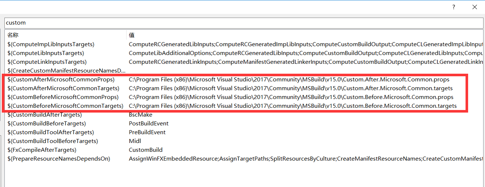

# C++的包管理
使用C++时,如果你想要用第三方库,那简直就是灾难,或许这就是为什么用C++的人都比较喜欢造轮子吧;值得庆幸的是C++社区一直在努力,目前C++标准委员会也成立了相应的小组来探索C++构建的标准化方案。

这里将主要基于Windows和Visual Studio来聊聊C++的包管理及其实现方案。

## 他山之石
如果使用Python,包管理工具是pip,且已集成在Python 2>=2.7.9或者Python 2 >= 3.4中,安装第三方库仅需要一条命令:
```
pip install SomePackage
```

如果使用Node.js,包管理工具是npm,内置于Node.js中,同样安装第三方库仅需要一条命令:
```
npm install <package_name>
```
当然C++与python、javascript等有所不同,C++的第三方库管理相对来讲比较复杂:
- 构造/安装
    - Win32/x64
    - Debug/Release 
- 配置/使用
    - 头文件路径
    - 库路径
    - 库依赖
    - 动态链接库依赖

更别说第三方库还有多种形态：源代码、二进制包、头文件;那么C++能够做到类似于Python或者Node.js这种效果么?

## 目标及可行性

C++的第三方包管理理论上能够达成如下目标么：
- 安装
    ```
    install package_name
    ```
- 使用
    ```
    #include <package.h>
    //code & build & run
    ```

### 库组成
C++的库分为以下组成部分：
- 头文件
- 库文件/静态链接库
- 动态链接库

常规的库目录结构如下：
- include
- lib
- bin

如果将第三方库仓库目录约定如下：
- libraries/仓库
    - include/头文件
    - lib/库文件
    - bin/动态链接库
    - debug/调试版本
        - lib/调试版库文件
        - bin/调试版动态链接库

安装一个第三方库就把库的内容分别输出到仓库目录的对应位置,这样就将多个第三方库的配置转换为单一库配置。

### 库构建
第三方库存在着不同的构建方法：
- MSBuild/Visual Studio
- CMake
- SDK/二进制包
- 头文件

针对不同的构建方法需要统一的脚本,来控制其构建,并将构建结果输出到对应的库目录

### 库依赖配置
第三方库使用时库依赖一般需要一个个配置,但是并不代表必须要配置具体的库依赖,如果配置好库目录,而库依赖使用的是`*.lib`,意为导入所有`.lib`文件,那么链接器会根据符号查找对应的lib进行链接,这就避免了约定具体库依赖。

### 动态链接库依赖
当软件运行时需要能够查找到依赖的动态链接库,通常情况下需要在工程构建时将所依赖的动态链接库复制到对应目录,如何解决自动查找依赖并复制动态链接库？

Visual Studio的dumpbin.exe可以输出动态链接库依赖信息:[dumpbin.exe /DEPENDENTS target](https://docs.microsoft.com/zh-cn/cpp/build/reference/dependents)
```
dumpbin.exe /dependents build_result.exe
dumpbin.exe /dependents build_result.dll
```
可以使用PownerShell脚本分析依赖的动态链接库,并从库仓库的bin路径下查找并复制对应的动态链接库。

### 初步解决方案
根据之前的分析,通过安装操作,将第三方库的构建结果输出到库仓库的对应目录,即可得到一个通用配置方案：
- include路径：libraries\include
- 库路径：libraries\lib或者libraries\debug\lib
- 库依赖：*.lib
- 动态链接库依赖：findAndCopy.ps1 libraries\bin或者libraries\debug\bin {build_result} 

基于这种方案,对于任何通过该方案安装的第三方库,都无需再进行配置;现在需要解决的是如何将这个配置作为默认配置,而不需要在新建工程时导入该配置?

### MSBuild及Visual Studio全局扩展点
Visual Studio构建采用的是MSBuild脚本,可以采用MSBuild脚本实现上述通用配置,那么Visual Studio的全局扩展点在哪里呢?

打开Visual Studio,新建/打开任意C++工程,在工程“属性”页签,定位到“C/C++”的“附加包含目录”,进入编辑状态,打开“宏”,输入“Custom”,可以看到如下结果：



其中`$(CustomBeforeMicrosoftCommonTargets)`即可作为扩展脚本位置,假设库仓库配置为`pkgUser.targets`,那么可以用如下脚本导入：
```XML
<?xml version="1.0" encoding="utf-8" ?>
<Project  ToolsVersion="4.0" xmlns="http://schemas.microsoft.com/developer/msbuild/2003">
    <PropertyGroup Condition="'$(PlatformToolset)' == 'v100'">
    <!-- 该文件位于.sln同级目录,需要将pkgUserRootPath指定到pkgUser内容目录 -->
        <pkgUserRootPath Condition="'$(pkgUserRootPath)' == ''">D:\pkgUser</pkgUserRootPath>
    </PropertyGroup>
    <ImportGroup Label="pkgUserTargets" Condition="'$(pkgUserRootPath)' != ''">
        <Import Condition="Exists('$(pkgUserRootPath)\pkgUser.targets')" Project="$(pkgUserRootPath)\pkgUser.targets" />
    </ImportGroup>
</Project>
```

###  解决方案
上述解决了库的使用问题,并对构建结果的输出做了约定,但是并没有约定如何构建库,这也是C++包管理器需要解决的关键问题,目前C++社区对这个的处理有两种不同的方法：
- 包发布者构造出第三方库并按照包管理器约定打包发送到中心服务器
- 包发布者编写脚本管理库的构建,并基于包管理器约定将构建结果输出到约定位置

其中[conan](https://conan.io/)采用的是第一种方式,而[Vcpkg](https://github.com/Microsoft/vcpkg)则采用第二种方式。

## **Vcpkg**
Vcpkg正是基于CMake,采用上述解决方案开发出的C++包管理器,我们来看看在Windows上的使用流程。

环境要求：
- Windows 10,8.1,7
- Visual Studio 2017 or Visual Studio 2015 Update 3 
- Git
- Optional:CMake 3.10.2

构建/安装：
```
> git clone https://github.com/Microsoft/vcpkg
> cd vcpkg
PS> .\bootstrap-vcpkg.bat
```
开启Visual Studio全局扩展点:
```
PS> .\vcpkg integrate install
```

第三方库安装：
```
PS> .\vcpkg install boost-beast catch2 qt5
```

第三方库使用(无需进行第三方库相关配置)：
1. 新建/打开工程
2. 编码
3. 编译
4. 运行

## 检视
不考虑Vcpkg的安装/构建,以及Visual Studio全局扩展点的注册,哪怕是在C++中,也可以做到和Python、Node.js使用第三方库一样的体验。

Conan这种库管理工具类似于Python或者Node.js的,有个中心化的库服务器,Vcpkg是默认去中心化的,这点有所不同。

Reddit上有关于[C++包管理器讨论的帖子](https://www.reddit.com/r/cpp/comments/8t0ufu/what_is_a_good_package_manager_for_c/),对现有的包管理器做了对比,当然Vcpkg的文档也和Conan进行了比较。


