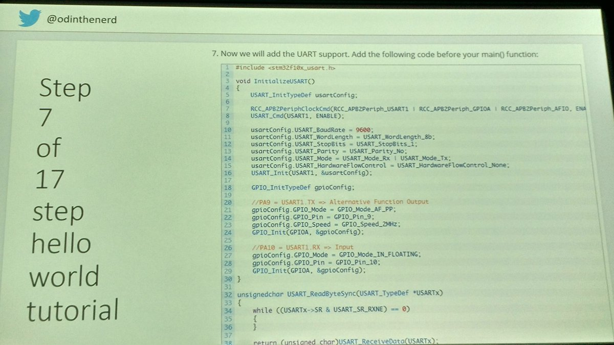
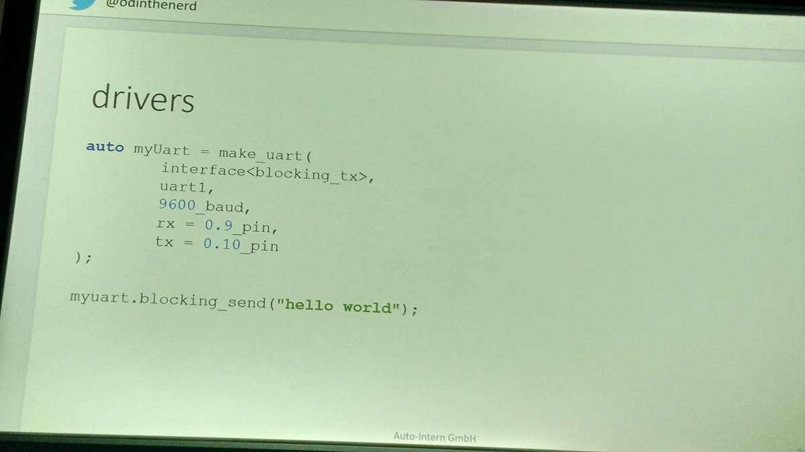

# Weekly ARTS

## Algorithm [3SumCloest](3SumClosest.md)

给定整数数组及目标值,求出最接近目标的三个整数和,主要考察的是利用已排序特性将二层循环展开成一层。

## Review

## Technique [ADL](ADL.md)

聊一聊C++中常常讲到,或者源代码中写的ADL是什么意思,怎么使用。

## Share 嵌入式系统-"被遗忘的角落"?

在数年之前,我还在苦心折腾嵌入式系统,用两个端口模拟IIC协议等等,ARM火起来后,开始使用恩智浦的STM32xxx系列芯片,与现在在PC机上写程序是完全不同的体验：连printf都没得用,更别说各种标准库之类,基本上都要自行实现。

已经是很久之前的事情了......不知道现在用嵌入式系统做物联网等等应用的是什么样的开发体验,是不是还是要这样玩：

由于嵌入式系统上资源的相对匮乏,大部分人还是用C语言开发,虽然芯片厂商一直在努力提供相关的库,进行开发时依然比较麻烦; **如果你觉得现在写程序很艰难,要学的东西太多,可以去挑战一下嵌入式系统**.

我也关注到一些使用JavaScript等等进行嵌入式开发的解决方案,很有思路;但是,连个C++都不大能用得上,还要去用JavaScript?怕不是只能用用树莓派发个微博浇浇花吧。

所幸C++专家们一直没有放弃这个领域,还在努力尝试,譬如利用了各种C++模板技术实现的辅助库：

兼具表现能力和效率,相见恨晚,在现在软件开发各种语言及方法层出不穷的情况下, **嵌入式系统不是处于被遗忘的角落,还有C++来帮助我们**。

感兴趣的可以去看看[Odin Holmes “C++ Mixins: Customization Through Compile Time Composition”](https://www.youtube.com/watch?v=wWZi_wPyVvs)