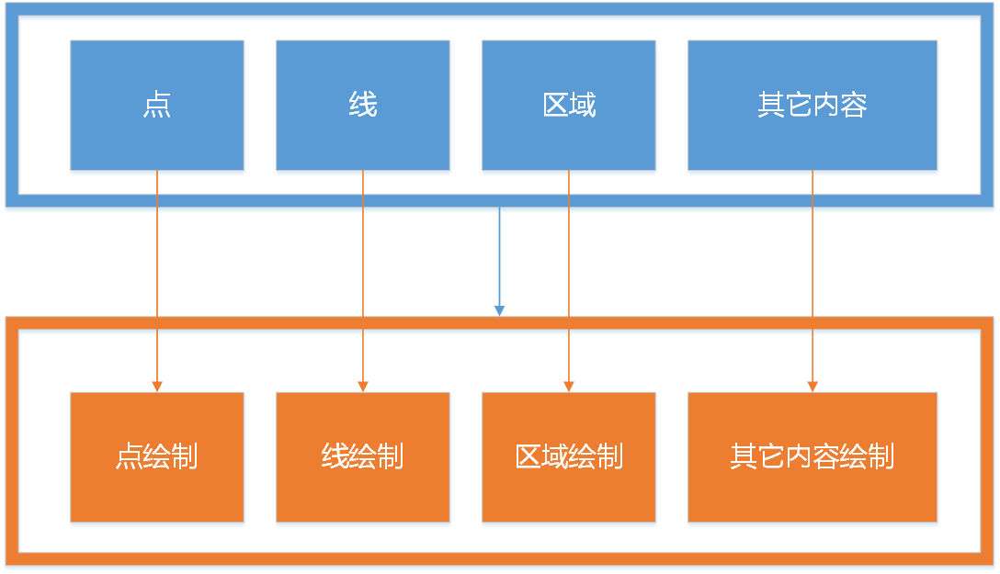

# 一种“渲染”功能的组合式写法

## 问题域

在2D绘图、三维渲染等等场景下,会有这样的情况,需要根据不同的内容进行特定绘图、渲染等操作,通常采用面向对象的方式会有如下写法：

```C++
//接口定义
class drawable
{
public:
    virtual ~drawable() = default;
    virtual void draw(canvas_t&  canvas) = 0;
};

//具体实现
class user_drawable:public drawable
{
public:
    virtual void draw(canvas_t& canvas) override;
};
```

在真实场景下`drawable`类型是有限的,譬如2D绘图中就是点、线、区域、路径等等,而需求没有止境,新的`drawable`通常是几种基本类型的组合,而采用面向对象的写法一方面要管理这几种类型的内容,另一方面要调用其`draw`方法实现自身的`draw`,能不能有方法避免这种场景?

## 设想

只提供基础类型的`draw`,特定类型如果是通过基础类型的排列组合构成,则无需实现`draw`,采用模板技术通过组合方式为特定类型提供`draw`.



例如在已有圆形基础上绘制环形：

```C++

struct circle_t;

void draw(canvas_t&  canvas,circle_t& circle);//基础类型绘制

struct ring_t
{
    using drawables = std::tuple<circle_t,circle_t>;//指定绘制内容类型
    std::tuple<const circle_t&,const circle_t&> draw_contents() const;//提供绘制内容
};
```

由示例可见,仅需要定义`ring_t`时指定绘制内容列表,并提供接口返回绘制内容,则`ring_t`即为可绘制对象,不需要为其定义`draw`方法。

## 如何实现

为演示方便,提供如下`drawable`定义,用来模拟绘制动作:

```C++
template<typename T>
struct drawable
{
    void draw(const T& t) {
        std::cout<< typeid(t).name()<<" draw result:" << t << std::endl;
    }
};
```

通过对`drawable`的模板特化可以为特定内容定义绘制方式,那么希望达到的预期是针对可`draw`类型无所专门实现`draw`即可绘制:

```C++
point_t point;
draw(point);

line_t line;
draw(line);

user_result_t user_result;
draw(user_result);
```

### 对可`draw`类型的约定

虽然无所专门为特定类型实现`draw`方法,还是需要提供足够的信息,否则无法生成对应模板实现。

根据之前的分析,特定类型应当是可绘制类型的组合体,这就需要特定类型提供组合类型列表,以及具体类的值,假定提供了`brushs`模板用来编译期生成绘制动作,那么特定类型需要提供以下两种内容：

```C++
struct user_result_t
{
    using brush_type = brushs<basic_type_1,basic_type_2,...>;//指定内容画笔

    std::tuple<basic_type_1,basic_type_2,...> contents() const;//返回绘制内容
};
```

也就是说,即需要指定特定类型包含了哪些基本类型,提供类型序列,也需要返回这些基本类型内容。

### `brushs`定义

`brushs`模板类需要提供`draw`方法来接收`user_result_t`提供的`contents`:

```C++
template<typename... Ts>
struct brushs
{
    void draw(std::tuple<Ts...>&& v);
};
```

### `draw`接口定义与实现

这时就可以提供全局的`draw`接口及其模板实现：

```C++
template<typename T>
void draw(T&& v){
    T::brush_type{}.draw(v.contents());
}
```

这样,只要是满足要求的`T`均自动支持`draw`方法。

### `brushs`实现

我们先提供特定类型的示例来分析`brushs`应该做些什么:

```C++
struct result_t
{
    using brush_type = brushs<int, double, std::string>;

    std::tuple<int, double, std::string> contents() const {
        return std::make_tuple(42, 3.1415926, std::string{ "drawable" });
    }
};
```

可以看到`result_t`包含了三种基本类型的值,这些基本类型分别由不同的`drawable`来进行绘制,那么就需要`brushs`根据类型列表提供以下内容：

```C++
drawable<int>;
drawable<double>;
drawable<std::string>;

//合并
std::tuple<drawable<int>,drawable<double>,drawable<std::string>>;
```

那么`brushs`中`drawable`的声明即为：

```C++
template<typename... Ts>
struct brushs
{
    //......
    std::tuple<drawable<Ts>...> impls;
}
```

而`brushs::draw`在这种情况下应该为:

```C++
void draw(std::tuple<int,double,std::string>&& v){
    drawable<int>.draw(std::get<0>(v));
    drawable<double>.draw(std::get<1>(v));
    drawable<std::string>.draw(std::get<2>(v));
}
```

相当于将两个类型个数相同的`tuple`变量按照索引进行调用,如何实现?

### `draw_invoker`

```C++
template<size_t N>
struct draw_invoker{
    template<typename Caller,typename Args>
    static void invoke(Caller&& caller, Args&& args) {
        draw_invoker<N - 1>::invoke(std::forward<Caller>(caller), std::forward<Args>(args));
        (std::get<N>(std::forward<Caller>(caller))).draw(std::get<N>(std::forward<Args>(args)));
    }
};
```

实现`draw_invoker`针对两个`tuple`,分别取`tuple`的第`N`个元素,一个作为`caller`,一个作为`args`,调用`caller`的`draw`方法,然后将`N`减一继续调用。

需要设置终止条件为:

```C++
template<>
struct draw_invoker<0>{
    template<typename Caller, typename Args>
    static void invoke(Caller&& caller, Args&& args) {
        (std::get<0>(std::forward<Caller>(caller))).draw(std::get<0>(std::forward<Args>(args)));
    }
};
```

注意`draw_invoker<N>`调用`draw_invoker<N-1>`在前,执行`draw`在后,是为了保证执行顺序,否则会将`tuple`逆序执行。

### `brushs`的完整实现

```C++
template<typename... Ts>
struct brushs
{
    template<size_t N>
    struct draw_invoker{
        template<typename Caller,typename Args>
        static void invoke(Caller&& caller, Args&& args) {
            draw_invoker<N - 1>::invoke(std::forward<Caller>(caller), std::forward<Args>(args));
            (std::get<N>(std::forward<Caller>(caller))).draw(std::get<N>(std::forward<Args>(args)));
        }
    };

    template<>
    struct draw_invoker<0>{
        template<typename Caller, typename Args>
        static void invoke(Caller&& caller, Args&& args) {
            (std::get<0>(std::forward<Caller>(caller))).draw(std::get<0>(std::forward<Args>(args)));
        }
    };

    void draw(std::tuple<Ts...>&& v) {
        draw_invoker<sizeof...(Ts) - 1>::invoke(impls, v);
    }
private:
    std::tuple<drawable<Ts>...> impls;
};
```

## 总结

编译期的模板技术避免了重复代码的书写,可以基于类型提供组合式的渲染、序列化等实现,并且支持扩展,能够达到事半功倍的效果,还会有性能方面的提升。

## 完整代码列表

```C++
#include <iostream>
#include <string>
#include <tuple>


template<typename T>
struct drawable
{
    void draw(const T& t) {
        std::cout<< typeid(t).name()<<" draw result:" << t << std::endl;
    }
};

template<typename... Ts>
struct brushs
{
    template<size_t N>
    struct draw_invoker{
        template<typename Caller,typename Args>
        static void invoke(Caller&& caller, Args&& args) {
            draw_invoker<N - 1>::invoke(std::forward<Caller>(caller), std::forward<Args>(args));
            (std::get<N>(std::forward<Caller>(caller))).draw(std::get<N>(std::forward<Args>(args)));
        }
    };

    template<>
    struct draw_invoker<0>{
        template<typename Caller, typename Args>
        static void invoke(Caller&& caller, Args&& args) {
            (std::get<0>(std::forward<Caller>(caller))).draw(std::get<0>(std::forward<Args>(args)));
        }
    };

    void draw(std::tuple<Ts...>&& v) {
        draw_invoker<sizeof...(Ts) - 1>::invoke(impls, v);
    }
private:
    std::tuple<drawable<Ts>...> impls;
};


template<typename T>
void draw(T&& v) {
    T::brush_type{}.draw(v.contents());
}

struct result_t
{
    using brush_type = brushs<int, double, std::string>;

    std::tuple<int, double, std::string> contents() const {
        return std::make_tuple(42, 3.1415926, std::string{ "drawable" });
    }
};

int main(int argc, char** argv) {
    draw(result_t{});
    return 0;
}
```