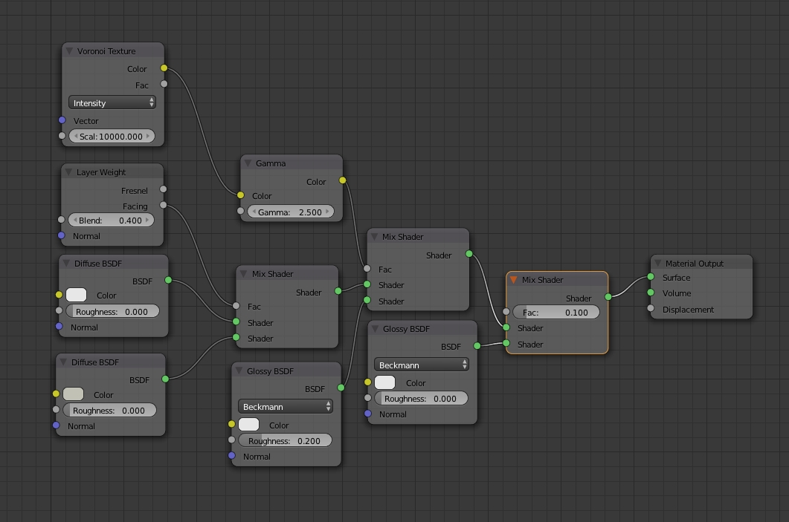

# Weekly ARTS

- 用回溯法套路leetcode题目,同时也被题目套路着...还是要活学活用
- 关于Qt的事件及其处理
- 隐藏构造函数的几种方法
- 其实“我”并不懂

## Algorithm [回溯法02](Backtracking02.md)

做了一些能够用回溯法套路的题目,但是解决方案并不理想......

## Reivew [Qt中的事件及其处理](QtEvent.md)

使用到Qt的QGraphicsView,发现其源代码里用到很多事件而不是直接调用,因此学习下Qt中的事件系统及消息循环。

## Technique [如何隐藏构造函数](HideConstructor.md)

在实现工厂模式等场景下,需要隐藏构造函数,又要保证能够构造,可以有几种方法来实现。

## Share 其实“我”并不懂

最近工作需要,要实现个节点编辑器,如下图所示:

之前一直在别人提供的框架基础上实现功能,脑子还算冷光,混了几年也算是有点儿名头;但是真正去从头开始设计并实现一个软件时,才发现自己很多东西并不懂。

譬如,针对UI,一般都是用MVC架构模式来实现,从而将模型、视图和交互分离,可能读过一些文章,看过点儿样例就觉得自己懂了.但是给你一个具体的场景,你如何采用MVC来设计和实现?

> Talk is cheap,Show me the code

如果你觉得你懂,你可以实现个试试看,来验证一下你是否真的懂。

通过"努力"学习,我们读了很多书单,看了很多文章,却依然写不好代码,在公司的平台之上反反复复来实现业务,自觉牛逼,可能扔到真实场景下赤膊上阵,不知道输得有多惨。

是时候正确认识自己,调整学习方式了。可以了解一下[The Learning Pyramid](https://www.educationcorner.com/the-learning-pyramid.html):

