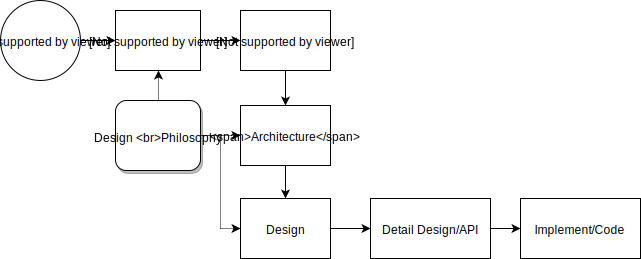

# 《Chapter 6 - How to make knowledge flow in your team》Review

It's a wonderful perspective!

Software development is not just a production process,at the same time, it is also accompanied by the accumulation and transmission of knowledge of large categories.If we only focus on results,not paying attention to the knowledge transfer in the process,the subsequent development process will be extremely difficult.We all suffered.

If you look at it from the perspective of knowledge transfer,Is writing a document,what is the topic of the document,not a problem for us.

I can understand what you are trying to say,but it may be difficult for some people. If you use some illustrations and examples,this will be easier to understand.

This is my view of software development,before `Detail Design` part,it should be in the document, others should be in the code.

I found some C++ standard proposal well written,it contains a lot of very usefull information,eg.

- Intoduction
- Motivation
- Proposal
- Design rationale
- Implementability
- References
- ...

You can refer to these for some examples.